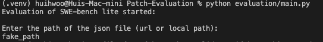
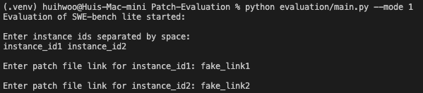

# SWE-bench Evaluation Helper

This repository contains a helper script to evaluate model predictions on the SWE-bench dataset.

# Usage

## Setup the environment

0. Pre-requisites

    - Docker Desktop (with `Allow the default Docker socket to be used (requires password)` selected, you can find this option in Docker Desktop -> Settings -> Advanced)
    - Python
    - pip

1. run following commands in terminal

    ```bash
      python3 -m venv .venv
      source .venv/bin/activate
      pip install -e .
    ```

2. Setup number of workers according to your device

    [evaluation/main.py line 44](evaluation/main.py)

    ```python
    max_workers=1, # default is 1
    ```

## Run following command to start the evaluation script

### mode 0 (default)

Input the path (or url) of the combined patch file and the instance id to evaluate the model prediction.

```bash
  python evaluation/main.py
```

<div style="text-align: center">
  
</div>

### mode 1

Input instance ids and patch file links manually according to instructions.

```bash
  python evaluation/main.py --mode 1
```

<div style="text-align: center">
  
</div>

## Disable the Cache

If you want to disable the cache, you can set the `--disable-cache` flag.

| disable-cache flag value | Description                               |
| ------------------------ | ----------------------------------------- |
| 0                        | Enable the cache (default)                |
| 1                        | Disable the cache                         |
| 2                        | disable the cache of unresolved instances |

```bash
  python evaluation/main.py --disable-cache 1

  # or
  python evaluation/main.py --mode 1 --disable-cache 2
```

## Modify Max Workers

You can modify the number of workers by setting the `--max-workers` flag, default is 0 (auto mode).

| max-workers flag value | Description                               |
| ---------------------- | ----------------------------------------- |
| 0                      | Auto mode (default), 3/4 of the CPU cores |
| 1                      | Single worker                             |
| k (k>0)                | k workers                                 |

```bash
  python evaluation/main.py --max-workers 2
```

# Evaluation Results

All of the evaluation results will be saved in the `history/` directory. Organized by timestamp (Month-Day-Hour-Minute-Second), each evaluation will be saved in a separate directory.

-   `Report.json`: contains all evaluation results

-   `predictions.json`: contains the model predictions for each instance
-   `test-instances.json`: contains the test instances

-   `log/`: contains the log file of the evaluation, includes some details of the evaluation process, organized by instance id
